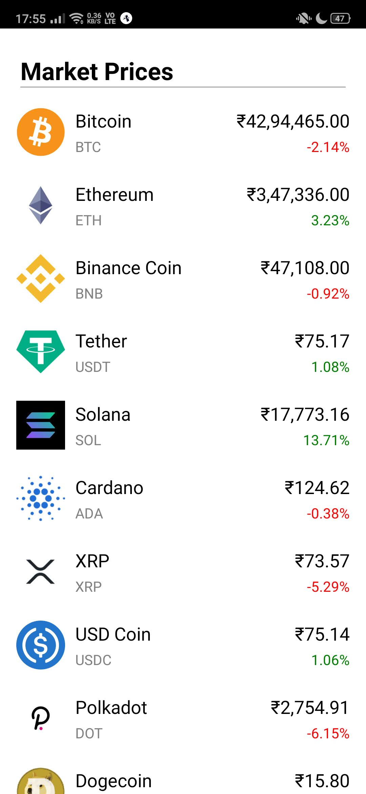
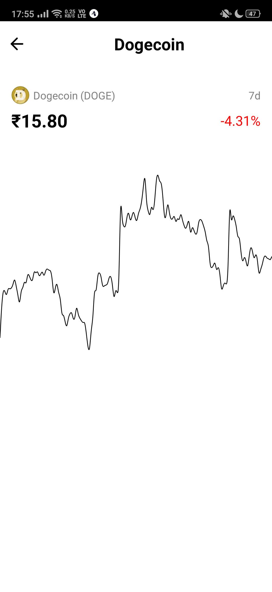

# Cryptocurrency Price Tracker
A mobile application that can track prices of various cryptocurrencies and shows previous 7 days data on charts. It is built on **React Native** and can work on both iOS and Android.

This application uses *CoinGecko API* to fetch latest cryptocurrencies market data

## Steps to install
1. Clone the repository
2. In same directory, use `npm install` to install all dependencies.
3. Use `npm start` to run the application.

You need **Expo** or Android Emulator / iOS Emulator for this application to work

## Screenshots from the application
 